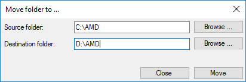
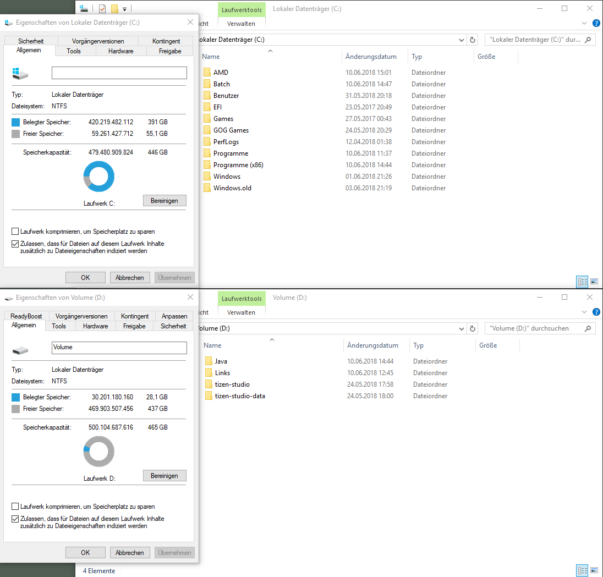
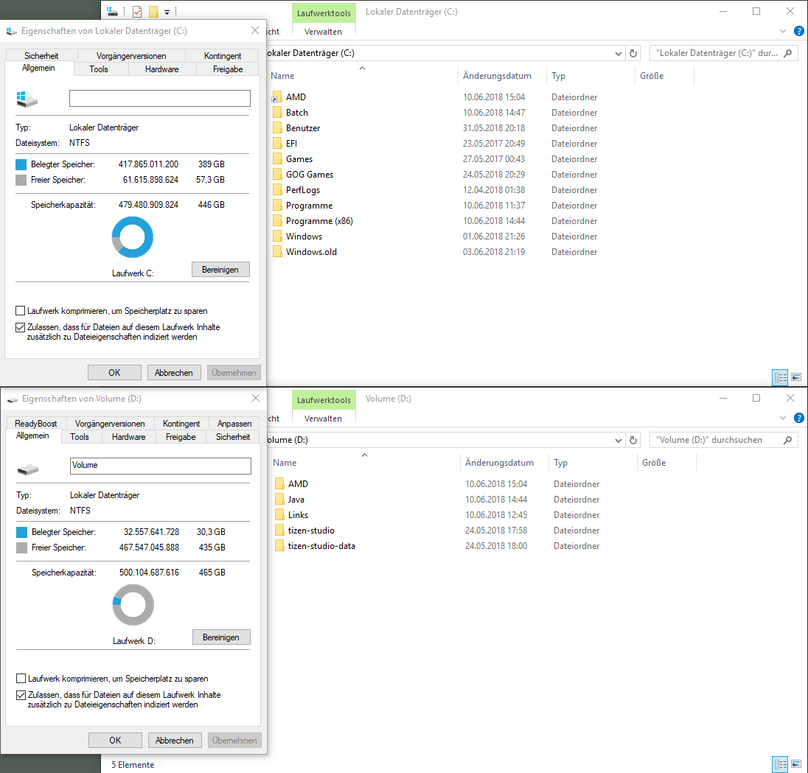

# FolderMove
Moves Folders from one location to another and creates a link in place of the old location.
This programm should be useful for people with an small SSD and a bigger HDD as a second drive.

Before:

After:

**Be careful with system files/folders!** Some will work, some will break your system.

# Installer

[ClickOnce](https://raw.githubusercontent.com/Zergie/FolderMove/master/ClickOnce/setup.exe)